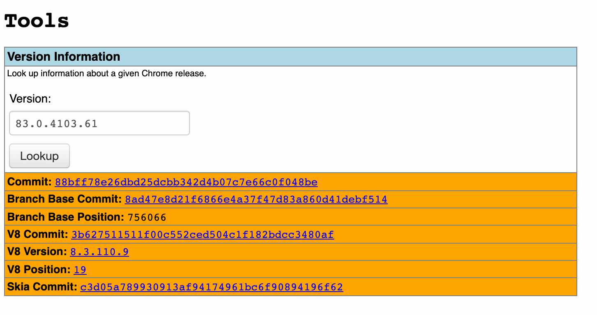

In last year or so it happened that I had to bisect Chrome/Chromium versions multiple times to verify if the issue is actually a browser bug rather than a bug in our product's code.

That's why I wanted to write the process down with all relative resources, so I don't have to look it up all the time.

> What is bisecting?
>
> Bisecting means dividing something into two parts. And is exactly what `git bisect` and binary search do.

## 1. Tools

Chromium has a python script for bisecting in the repository. We just need to download it – [tools/bisect-build.py](https://chromium.googlesource.com/chromium/src/+/master/tools/bisect-builds.py). And it requires **Python 2** to work.

More info and examples are in this guide: [Bisect builds](https://www.chromium.org/developers/bisect-builds-py).

## 2. Finding a version range

For any bisecting we need to have a ref of a good and a bad revision. In most cases the bad one is going to be the current stable version that we or our customers use. We can look it up in [chrome://version](chrome://version). For example: `83.0.4103.61`. Unfortunately this is not what the tool expects, and we need to convert semver version number into a `Branch Base Position`. And we can do it using another tool, called [omahaproxy](http://omahaproxy.appspot.com/).

> IMPORTANT: Branch Base Position is not a build number.

It may also be useful to refer to this Wikipedia page to find a specific version number of a chrome major release: [https://en.wikipedia.org/wiki/Google_Chrome_version_history](https://en.wikipedia.org/wiki/Google_Chrome_version_history). I couldn't find any better source of chrome version numbers, if you have one in mind, don't hesitate to message me.

## 3. Bisecting

Once we have a good and a bad `branch base position` we can go straight to bisecting:

> `$ python bisect-builds.py -a platform -g good-revision -b bad-revision --use-local-cache`

After running this command `bisect-builds.py` will lunch a browser with a picked version. Quit the browser and this script will prompt you about the results of testing this particular browser build.

Once finished bisect script gives a link to a range of commits included in a [broken build](https://chromium.googlesource.com/chromium/src/+log/1093f7c3075a560890b1e344197c9c7a71d19de2..8129cac24ef449e6784c459d8db8bb61700a7034).

Unfortunately it's impossible to go to a by commit level of granularity if you are not a Google employee...

## Links

All of the links mentioned above:

- [https://www.chromium.org/developers/bisect-builds-py](https://www.chromium.org/developers/bisect-builds-py)
- [Wikipedia: Google Chrome version history](https://en.wikipedia.org/wiki/Google_Chrome_version_history)
- [Omahaproxy](http://omahaproxy.appspot.com/)
- [Chromium Bug Tracker](http://crbug.com/)
