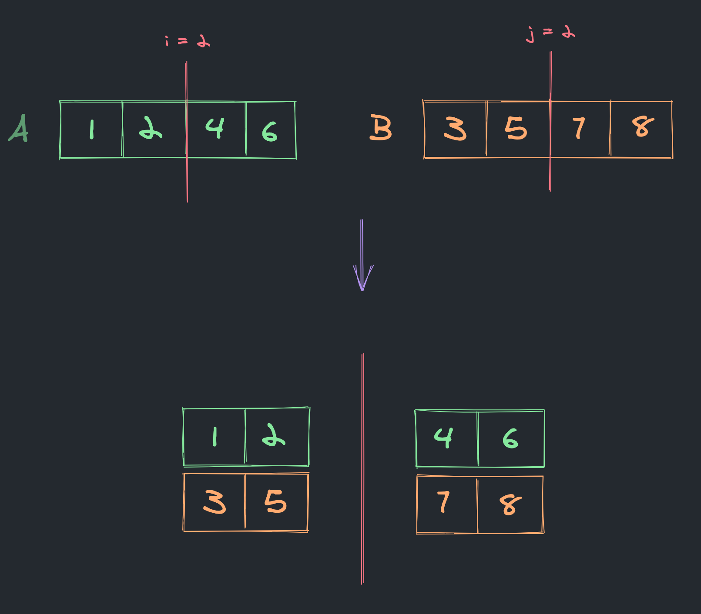
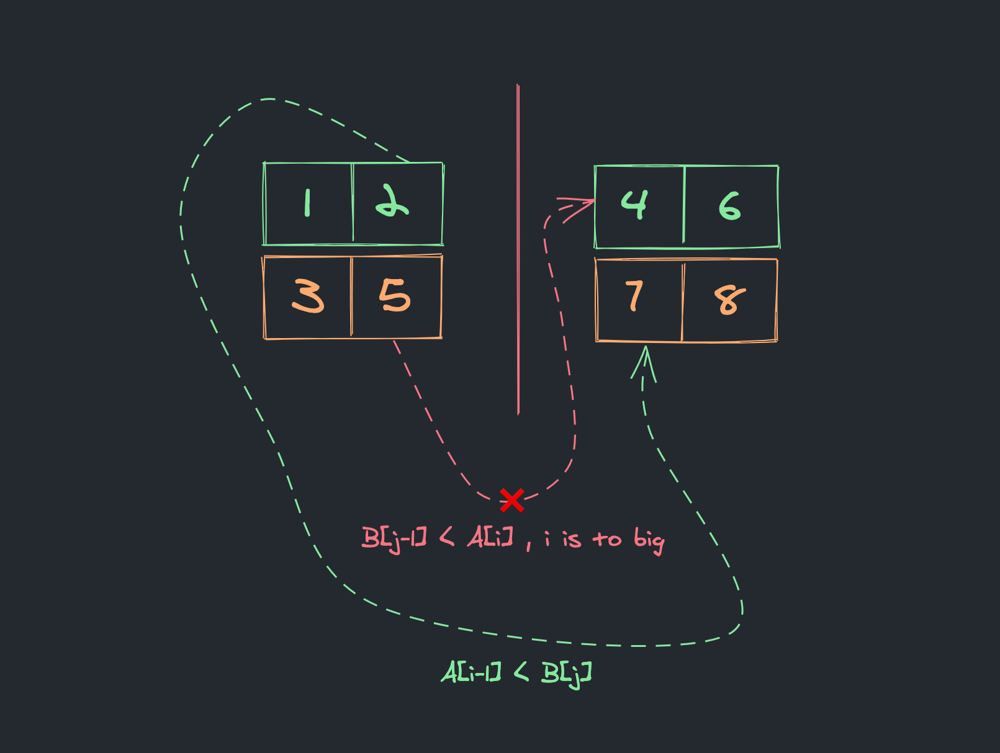
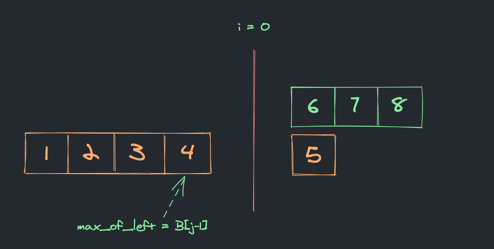

LeetCode Link – [4. Median of Two Sorted Arrays](https://leetcode.com/problems/median-of-two-sorted-arrays/) [hard].

> There are two sorted arrays `A` and `B` of size `m` and `n` respectively.
> Find the median of the two sorted arrays. The overall run time complexity should be `O(log (m+n))`.

I've been struggling to fully understand the [solution](https://leetcode.com/problems/median-of-two-sorted-arrays/solution/) from leetcode for quite some time. And if you open the link you can probably see why. It's been hard to visualize it in my head, and this is how I understand a solution the best.

So let's jump in and do a step by step break down of one of the test cases. Hoping that this time it does stick 😀.

But first – it's important to understand what does "median" mean and what it is used for.

> Median — is a value separating the higher half from the lower half of a data sample. [Wikipedia](https://en.wikipedia.org/wiki/Median)


With this out of the way, it's time to introduce the test case for our break down:

```python
A = [1, 2, 4, 6]
B = [3, 5, 7, 8]
```

The essence of the algorithm is to keep splitting both `A` and `B` at some point, which is going to be adjusted by a slightly modified version of a [binary search](https://en.wikipedia.org/wiki/Binary_search_algorithm). And to put `left_a` and `left_b` into one set and `right_a` and `right_b` into another one. The split point is not random and for us to be able to find it properly we need to introduce 3 new variables:

```python
imin = 0 # the leftmost position in the A array, will be adjusted with binary search.
imax = len(A) # the rightmost position in the A array, will be adjusted with binary search.
half_len = (len(A) + len(B) + 1) // 2 # half of both A and B length combined.
```

Once we have these variables defined we can calculate `i` and `j` which are split points in `A` and `B` respectively:

```python
i = (imin + imax) // 2
j = half_len - i
```

This ensures that the left and the right parts have the same size:



For the split to be correct it needs to satisfy the following condition:

> The biggest element on the left side is smaller or equals to the smallest element on the right side.



After the initial split, we have the case when the biggest element on the left side is bigger than the smallest element on the right side, which means we need to adjust the split point by moving `imin` to `i + 1` position. This is the binary search approach. Where before the first split we were considering values between `0` and `len(A)` and now the set of values had been reduced and only includes the range between `3` and `len(A)`.

Using the same formula from before calculate next split point:


This split point satisfies all of the required conditions and there is only one step left which is to calculate a median using the following formula:

```python
median = (max_of_left + min_of_right) / 2.0 # if combined length of A and B is even
median = max_of_left # if combined length is odd
```

> And the result is – `4.5`.

## Edge Cases

Let's consider the following edge cases:

### Nothing on the left side of A.

In case when `i = 0`, `max_of_left` equals to `B[j-1]`.



### Nothing on the right side of A.

In case when `i = len(A)`, `min_of_right` equals to `B[j]`.


### Nothing on the left side of B.

In case when `j = 0`, `max_of_left` equals to `A[i-1]`.


### Nothing on the right side of B.

In case when `j = len(B)`, `min_of_right` equals to `A[i]`.


## Runtime complexity

Time and space complexities are very well described in the leetcode solution, so i just copied them from there:

> Time complexity: `O(log(min(m,n)))`.
>
> At first, the searching range is `[0,m]`. And the length of this searching range will be reduced by half after each loop. So, we only need `log(m)` loops. Since we do constant operations in each loop, so the time complexity is `O(log(m))`. Since `m <= n`, so the time complexity is `O(log(min(m,n)))`.

> Space complexity: `O(1)`.
>
> We only need constant memory to store 9 local variables, so the space complexity is `O(1)`.

## Full source code of the solution

```python
def findMedianSortedArrays(A, B):
    m, n = len(A), len(B)
    if m > n:
        return findMedianSortedArrays(B,A)

    if n == 0:
        return None

    imin, imax, half_len = 0, m, (m+n+1) // 2
    while imin <= imax:
        i = (imin + imax) // 2
        j = half_len - i

        if i < m and B[j-1] > A[i]:
            # i is to small, must increase it
            imin = i + 1
        elif i > 0 and A[i-1] > B[j]:
            # i is to big, must decrease it
            imax = i - 1
        else:
            # i is perfect
            if i == 0: max_of_left = B[j-1]
            elif j == 0: max_of_left = A[i-1]
            else: max_of_left = max(A[i-1], B[j-1])

            # if cobined length is odd
            if (m+n) % 2 == 1:
                return max_of_left

            if i == m: min_of_right = B[j]
            elif j == n: min_of_right = A[i]
            else: min_of_right = min(A[i], B[j])

            return (max_of_left + min_of_right) / 2.0
```
