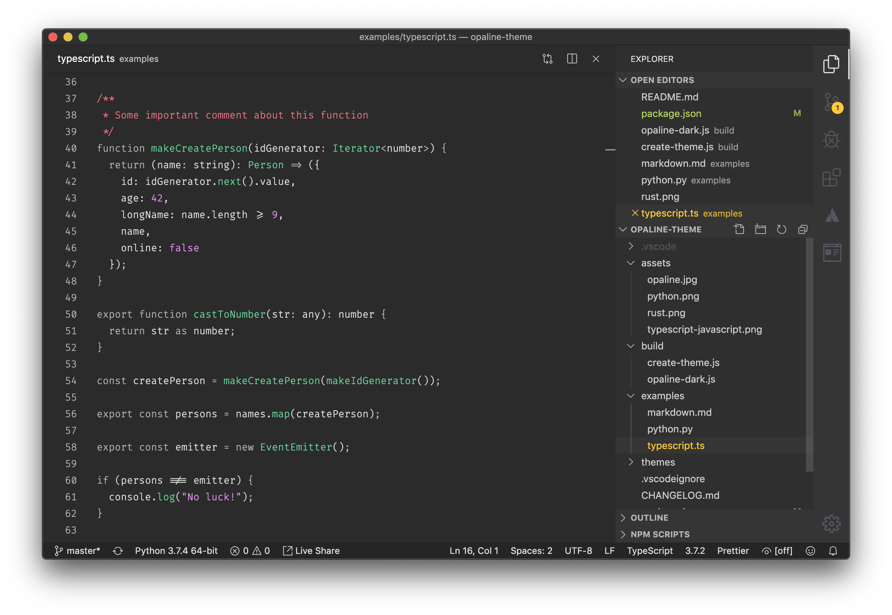
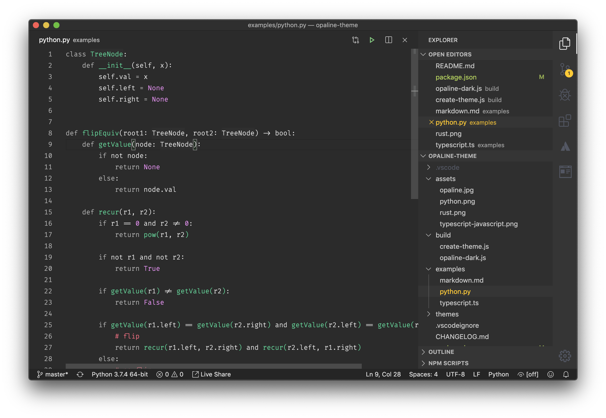
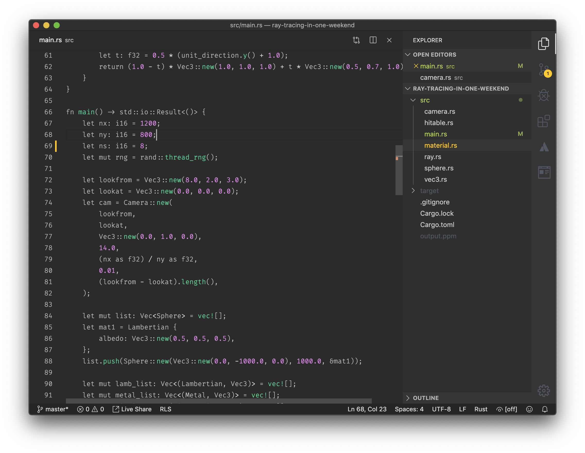

<a href="https://marketplace.visualstudio.com/items?itemName=sysoev.opaline-theme" style="width: 300px; display: block; margin: 0 auto;">
  
  Install Opaline Theme
</a>

I'm a frequent syntax highlighting theme switcher, and my usual go to list includes a lot of vscode themes: [Dracula](https://marketplace.visualstudio.com/items?itemName=dracula-theme.theme-dracula), [Monokai Pro](https://marketplace.visualstudio.com/items?itemName=monokai.theme-monokai-pro-vscode), [Night Owl](https://marketplace.visualstudio.com/items?itemName=sdras.night-owl), [1984](https://marketplace.visualstudio.com/items?itemName=juanmnl.vscode-theme-1984) just to name a few.

But at some point I started noticing that most of the currently available themes are very highlighting intense. Almost every single token type has its uniq color, which makes it particularly difficult to recognize important parts of a program as when everything is important – nothing is...

Then I've stumbled upon [Alabaster](https://github.com/tonsky/vscode-theme-alabaster) theme from [@tonsky](https://github.com/tonsky) and his idea of having minimal syntax highlighting really got my attention.

## What minimal syntax highlighting gives you?:

> Only highlight what's important!

Usually we think that language key words must be highlighted, why wouldn't they be? But this idea of minimal syntax highlighting is actually challenges that, and excludes them from "important to highlight" groups. As they are usually the least important and we are all used to reading them, and recognizing them.

Instead Opaline theme defines 4 main categories for highlighting (which are a bit different from Alabaster):

1. Functions, Types and Classes
2. Constants
3. Attention seekers
4. Default

One of the most prominent examples of "Attention seekers" is a comment. We are used to the fact that syntax highlighting themes dim comments, make them less noticeable. But if code deserved a comment to explain what it does – we better read that comment. That's why Opaline and Alabaster emphasize comments.

Another advantage of minimal number of rules/categories it makes it easier to scan through the program looking for a particular type of token as oppose to seeing that everything is highlighted...

## Opaline

Enough about minimal syntax highlighting (i strongly encourage you to read [Alabaster's README](https://github.com/tonsky/vscode-theme-alabaster)), lets talk about Opaline.

> Opaline – is a high-contrast vscode theme with minimal syntax highlighting.

Main goal for this theme was to have very good contrast, it must be at least `AA (4.5+)` and in a lot of places it's actually `AAA (7.0+)` at the same time it doesn't look to punchy and is very easy on eyes.

Since my day-to-day mostly involves coding using: `TypeScript`, `Python` and `Rust`, these languages have the best support.

And here are some screenshots:

I've been using this theme for the past couple of month and find it very useful, the minimal syntax highlighting really works for me. Give it a try maybe it works for you too!

If any issue, please report here: [d4rkr00t/opaline-theme](https://github.com/d4rkr00t/opaline-theme)

[Install Opaline Theme](https://marketplace.visualstudio.com/items?itemName=sysoev.opaline-theme)
